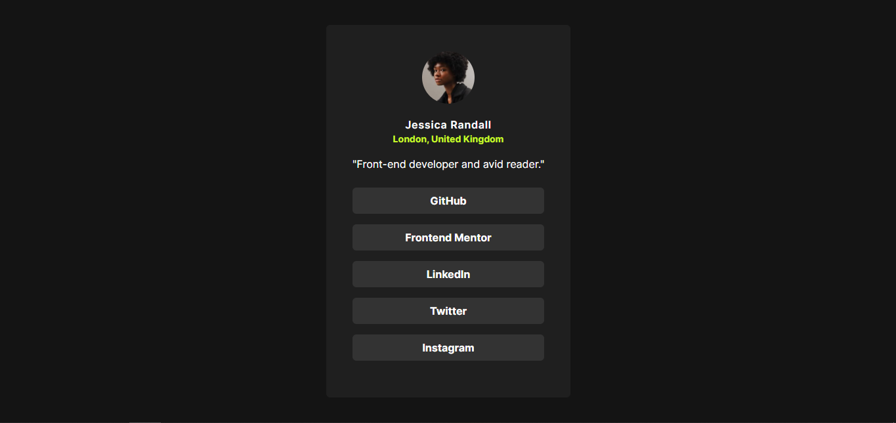

# Frontend Mentor - Social links profile solution

## Table of contents

- [Overview](#overview)
  - [The challenge](#the-challenge)
  - [Screenshot](#screenshot)
  - [Links](#links)
- [My process](#my-process)
  - [Built with](#built-with)
  - [What I learned](#what-i-learned)
  - [Continued development](#continued-development)
  - [Useful resources](#useful-resources)
- [Author](#author)

## Overview

### The challenge

Users should be able to:

- See hover and focus states for all interactive elements on the page

### Screenshot

### Links

- Solution URL: [Solution repo](https://github.com/george5-star/social-links-profile)
- Live Site URL: [Live preview](https://social-links-profile-gamma.vercel.app/)

## My process

### Built with

- Semantic HTML5 markup
- Mobile-first workflow
- [React](https://reactjs.org/) - JS library
- [TypeScript](https://www.typescriptlang.org/) - TypeScript
- [Tailwind CSS](https://tailwindcss.com/docs) - Tailwind CSS

### What I learned

I learned how to hosting react projects using vercel.

### Continued development

React, TypeScript, TailwindCSS.

### Useful resources

- [Tailwind Docs](https://tailwindcss.com/docs) - This is the official tailwind docs I used for reference.

## Author

- Website - [www.georgeasiedu.tech](https://www.georgeasiedu.tech)
- Frontend Mentor - [@george5-star](https://www.frontendmentor.io/profile/george5-star)
- Twitter - [@george5_star](https://www.twitter.com/george5_star)
